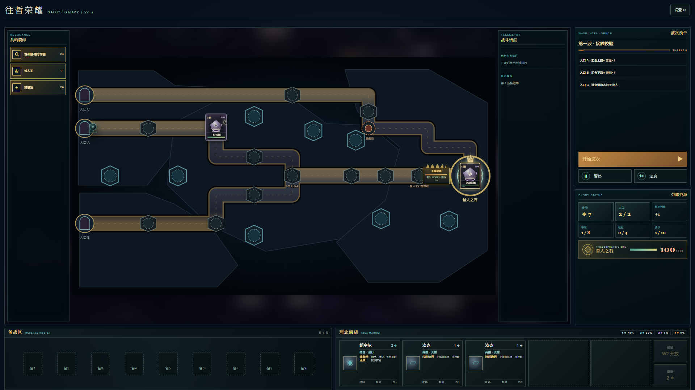
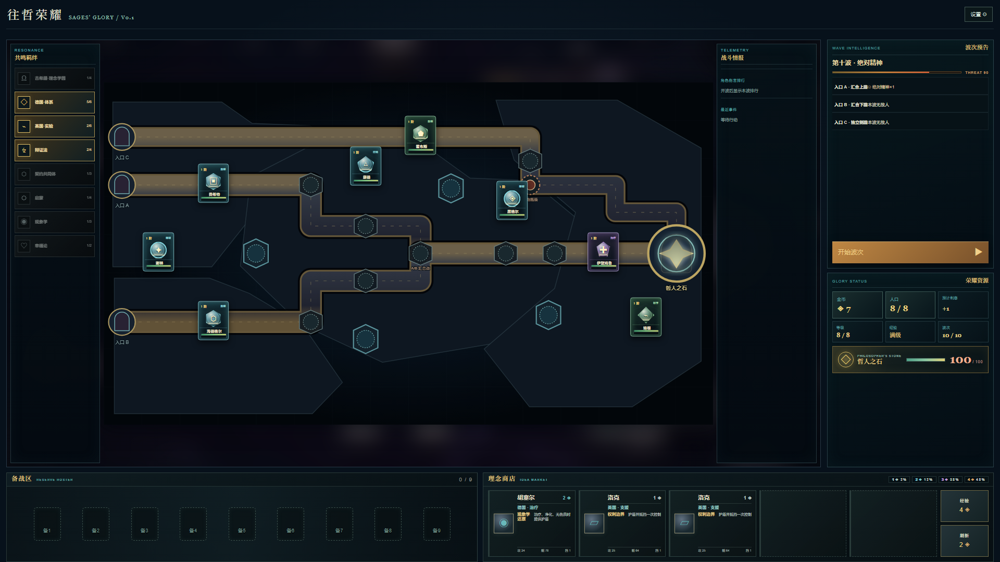
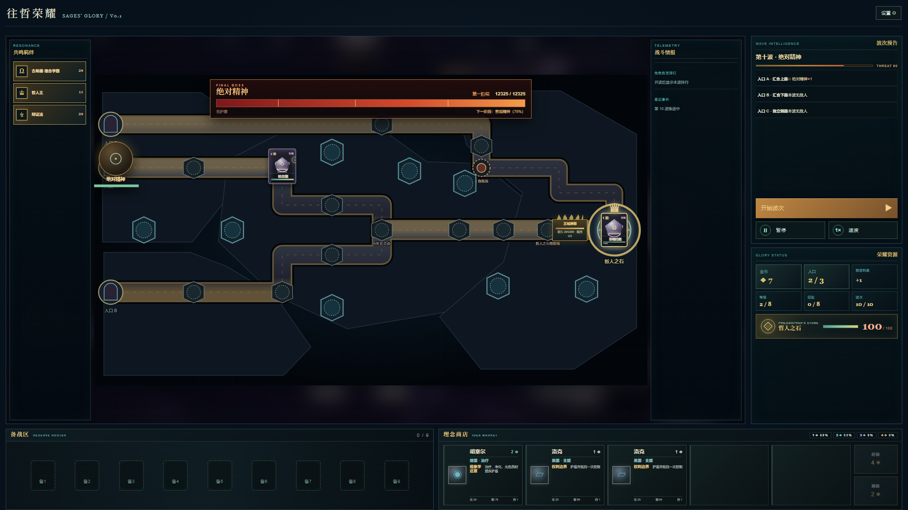

# Sages' Glory — 往哲荣耀



**Sages' Glory** is a single-player strategy game prototype that combines fixed-route tower defense with auto-battler economy and team-building. Deploy philosophers across three authored lanes, build philosophical resonances, make preparation-stage decisions, and defend the Philosopher's Stone through ten escalating waves.

This repository contains the source for the **v0.1 Demo**. The interface is currently in Simplified Chinese.

## Features

- 25 playable philosophers with deterministic active skills
- Eight-unit roster building, shop rerolls, experience, interest and three-copy upgrades
- Three fixed enemy routes with ground blocking and highland deployment
- Four major factions: Ancient Greece, Germany, France and Britain
- Six smaller philosophical resonances with asymmetric activation thresholds
- Player-facing preparation choices, including the Greek rostrum, French revolution node, British research and Enlightenment agenda
- Philosopher King throne and Royal Barrier unlocked by a two-star Plato
- Ten-wave campaign with the W5 boss **Cave Shadow** and W10 final boss **Absolute Spirit**
- Versioned V6 local save migration, wave retry checkpoints and balance-report export
- Deterministic combat core with fixed time steps, an event queue and non-recursive effect guards

## Screenshots

| Three-lane formation | Final boss encounter |
| --- | --- |
|  |  |


## How to run

### Portable Windows Demo

Download the Windows portable ZIP from the repository's **Releases** page, extract the entire archive, and double-click `启动往哲荣耀.cmd` or `start-game.cmd`. The portable build includes its own Node runtime and does not require a development environment.

### Development

Requirements: Windows and Node.js 22.13 or newer.

```powershell
npm.cmd install
npm.cmd run dev
```

Open `http://127.0.0.1:3000` if it does not open automatically.

Run the complete quality gate with:

```powershell
npm.cmd test
```

The test command runs TypeScript checking, ESLint, a production build, deterministic engine tests and rendered-HTML structure tests.

## Project structure

- `app/page.tsx` — application entry point
- `app/game/GameClient.tsx` — main game interface
- `app/game/engine.ts` — economy, roster, preparation and durable state
- `app/game/combat-core.ts` — deterministic combat primitives and snapshots
- `app/game/battle.ts` — wave simulation, blocking, bosses and combat resolution
- `app/game/positions.ts` — frozen 1600×900 map coordinates and stable IDs
- `tests/` — engine, rendering, browser interaction and release smoke tests
- `scripts/` — balance simulation, map export and portable packaging

## Built with

- TypeScript
- React 19
- vinext and Vite
- Node.js
- Cloudflare Vite tooling
- Node's built-in test runner

## Demo notes

See [DEMO.md](DEMO.md) for gameplay instructions, scope and feedback guidance. The current battlefield art is temporary; route, deployment and combat coordinates are already frozen for the Demo.

## Development process

Developed with **OpenAI Codex** as an implementation, testing and review collaborator. Game design direction, rules and playtest decisions were provided by the project owner.

## License

Released under the [MIT License](LICENSE).
