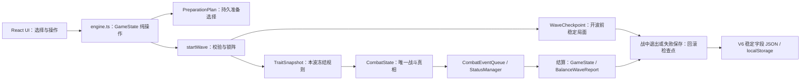
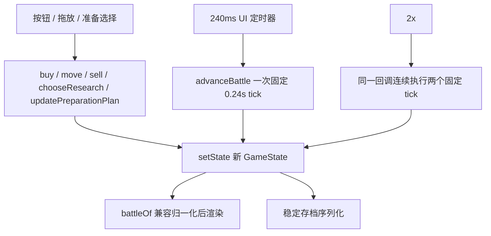
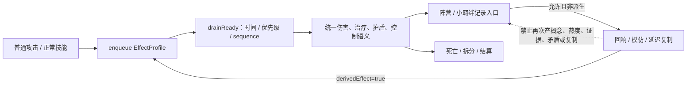

# 《往哲荣耀》Sol 架构与长期运行审计

## 2026-07-23 V0.2 候选版持久化与表现层收口

- 持久化域明确分为 V7 局内状态、Profile V3 局外历史和独立 Audio V1 设置；三者使用不同 localStorage 键，音量/静音和本局新任务提示没有进入战斗真相或对局存档。
- Profile V3 只记录已见事件、意识形态、完成组合、战争机器波次和胜利对局 ID；`observeGameState` 从引擎状态观察并以集合/波次键去重，档案占位奖励不会进入运行时内容注册表。
- 胜利次级总结只聚合持久的 `BalanceWaveReport`，关键棋子排序使用稳定同分规则；React 仅跟踪本次页面运行中新完成任务用于展示，整局重开时清零，不参与任务达成判定。
- Web Audio 是完全可失败的表现适配器：事件发生 ID 去重、节流和最多四声部在播放器边界完成；无 AudioContext、自动播放拒绝或节点异常只静默返回，调用者的引擎动作已经独立提交。
- 集中式 V7 压力矩阵证明 W3 未确认事件、宗教改革未选候选、W6 未选意识形态、损坏/重复字段和未知字段均保持安全继续语义；完整矩阵见 `SAVE_COMPATIBILITY_AUDIT.md`。

## 2026-07-23 历史事件生产闭环复审

- 历史规则保持单向状态流：`HistoricalEventState` 是耐久事实，`resolveHistoricalEffectsFromState` 是派生真相，`GameClient` 只展示派生结果并调用引擎动作。没有把事件倍率、奖励或随机抽取写入 React 状态。
- W3/W6 双层门禁：UI 禁用开波并展示决策弹层，`startWave` 再用 `pendingHistoricalDecision` 拒绝绕过。测试辅助函数仍仅属于测试，不再承担生产可达性。
- 事件随机边界收口：事件抽取、立场候选、改良替换和工业免费刷新都推进可保存的历史 cursor；普通付费刷新、胜利补货和战斗仍使用其原有可注入随机源。已保存的事件与候选始终比池配置更权威。
- 世界大战没有侵入 `waves.ts` 的 W5/W10 定义：集中解析器只为 W4/W7/W9 返回计划，`startWave` 追加稳定敌人类型与路线，战斗状态保存本波机器计数，结算通过通用历史奖励标记一次性提交。
- V7 导入顺序改为先迁移历史子状态、再按实际人口上限净化槽位；运行中/战败持久化和读取都恢复同一完整检查点。五月风暴高人口、事件 cursor、经济流水和报告历史不会跨边界丢失或重复。
- 防御性重构没有拆分 `battle.ts` 或改写角色技能。额外修复死亡阶段后的阻挡拓扑：当接触伤害在 tick 尾部杀死地面棋子时，同 tick 再次执行纯阻挡解析，返回状态不再含悬空实体引用。
- `activeEffects`、`waveOverrideIds` 保留为 V7 兼容扩展字段；当前生产解析器不读取它们，文档明确其非权威地位，避免未来出现两套事件效果源。增加字段时应升级历史子状态版本并提供逐版迁移，不应删除旧字段。

## 2026-07-17 最终地图替换的状态边界

- 最终图片仅是 `MapArt` 的不可交互绘制层；拖放合法性仍由 `Piece.characterId → terrain → SlotId` 与 `positions.ts` 决定，没有通过图片像素、DOM 文本或 CSS 颜色判断游戏逻辑。
- 运行时图片预先归一为 1600×900，与 SVG 调试层、部署层和敌人层共用同一坐标面。底图 `pointer-events:none`，部署层保持独立 z-index，未引入新的状态源或存档字段。
- 系统 Chrome 对实际计算样式和拖放链路的回归已通过；该替换不改变战斗确定性、事件顺序、地图指纹或 V6 存档语义。

## 2026-07-16 难度曲线后续改动的架构边界

- W2–W4、W7–W8 的调整只修改 `app/game/waves.ts` 的既有配置记录；W6、W9、W10 按玩家要求保持目标值，没有新增按波次写死在 `battle.ts` 或 React 中的分支。
- 模拟工具只增加早期阶段阵容和环境变量筛选，不进入正式包热路径。新增回归通过公开 `startWave`/`advanceBattle` 观察结果，没有复制伤害公式或另建第二套战斗真相。
- 不涉及存档字段、快照版本、地图坐标、状态所有权或事件顺序，不新增 P0/P1 架构债。完整门禁 90/90 通过。

审计基线：`e47dd7d`（已发布 V0.1 Demo）
审计分支：`audit/sol-architecture-20260716`
审计方式：代码与调用链审查、现有 80 项回归、TypeScript、lint、production build、确定性/迁移/连续波次定向测试；本轮不使用 Codex 内置浏览器，也不重复基础拖放手测。

## 结论

项目不是需要推倒重写的“屎山”。核心规则已经具备固定步进、战斗快照、事件队列、稳定实体 ID 和存档白名单，80 项基线测试也覆盖了大量高风险机制。真实问题集中在少数边界：旧状态的嵌套对象仍可能被下一 tick 反向修改、失败重试不是完整检查点回滚、导入端比导出端宽松、未来版本存档没有拒绝策略，以及 React 自动存档在战斗帧上做重复同步写入。

下列 P0/P1 都能以局部修改和直接测试处理，不需要替换战斗架构、改变地图或重写 25 名角色。随机源持久化、技能注册表重构等会触及存档或大范围战斗语义，本轮只记录，不实施。

## 实施结果（2026-07-16）

| 审计项 | 处理结果 | 行为边界 |
|---|---|---|
| P0-1 未来存档降级覆盖 | 已修复 | V6 及旧存档照常迁移；V6 以上版本保留原键、阻止自动覆盖并提示用户 |
| P1-1 tick 反向修改输入 | 已修复 | 只复制实际会被写入的嵌套记录；单次战斗结果不变 |
| P1-2 重试检查点不完整 | 已修复 | 等级、经验与核心生命均回滚到开波检查点；失败不能复制经验或治疗核心 |
| P1-3 导入临时字段/非法槽位 | 已修复 | 合法 V1–V6 保留；损坏输入按稳定字段、人口、地形和唯一槽位净化 |
| P1-4 `SlotId` 退化 | 已修复 | 编译期收紧为 9 备战位、20 部署位和王座的封闭联合 |
| P1-5 战斗帧重复存档 | 已修复 | 保存内容不变，相同规范 JSON 不重复写入 `localStorage` |
| P1-6 漂移旧 UI | 已删除 | `git grep` 证明无引用；现行共鸣组件与 CSS 未改 |
| P2-3 路线静态度量 | 已独立优化 | 三条路线坐标、地图指纹、阻挡与移动回归完全不变 |
| P0-2 胜利波阵亡导致永久丢棋 | 已修复 | 波内死亡仍立即退出；成功结算按波前稳定阵容复活，失败重试与存档语义不变 |

没有改动经济、敌人、角色、技能、羁绊、Boss、地图坐标、UI 风格或存档版本号；没有引入新的运行时依赖。

## 数据流与唯一所有者

### 准备阶段到存档

- `GameState` 拥有跨准备阶段的经济、阵容、波次与持久选择。
- `CombatState` 拥有本波敌人、计时、事件、状态、结构、统计和结算；React 只读取并调度固定 tick。
- `TraitSnapshot` 拥有本波羁绊与准备选择的冻结视图；单位死亡不重算。
- `WaveCheckpoint` 拥有开波前原子回退点；战中存档不得从正在变化的 `CombatState` 拼装稳定数据。
- DOM/CSS 只负责显示和交互，不作为规则输入。

### React 与引擎

定时器、`pagehide` 监听和短时 UI timeout 都有卸载清理；没有发现旧战斗循环在组件卸载后继续运行。当前生命周期风险不是监听器泄漏，而是每个战斗 tick 都触发同步 `localStorage.setItem`。

### 技能与派生效果

25 名角色仍在 `battle.ts::castSkill` 中按稳定 `SkillId` 分支。这不够模块化，但当前共享效果已走事件队列，派生保护集中且测试充分；全面注册表化会同时触碰全部角色，收益不足以抵偿回归风险。

## P0

### P0-1 未来版本存档会被旧客户端静默降级覆盖

- 位置/调用链：`app/game/engine.ts::migrateState` → `app/game/GameClient.tsx` 启动恢复 effect → 自动保存 effect。
- 真实场景：玩家先运行未来 V7+，再误开当前 V6 Demo。`migrateState` 忽略较大的 `saveVersion`，把能识别的字段降为 V6；组件随后进入 `started=true` 并立即覆盖同一个 `localStorage` 键。
- 结构风险：这是不可逆的数据损坏，不是迁移代码写法偏好。旧程序无权解释未来字段语义。
- 最小修复：对数值型 `saveVersion > SAVE_VERSION` 抛出可识别的“不支持未来版本”错误；启动恢复保留原始键，不删除、不自动保存，并显示可理解警告。
- 行为影响：当前 V6、V1–V5 和无版本旧存档不变；只改变不受支持的未来存档处理。
- 针对性测试：未来版本必须拒绝；V1–V6 仍可迁移；拒绝路径不得产生降级后的 V6 JSON。
- 范围/依赖：`engine.ts`、`GameClient.tsx`、引擎测试；不触碰战斗规则。

## P1

### P1-1 `advanceBattle` 会修改输入状态的嵌套敌人/记录对象

- 位置/调用链：`battle.ts::advanceBattle` 的敌人浅拷贝 → `recordBritishEvidence` 修改 `Enemy.evidence`；`psychoanalysis` 顶层浅拷贝 → 伤害记录修改 `PsychoanalysisRecord.stored`。
- 真实场景：对同一个 `GameState` 调用两次 `advanceBattle`，第一次会把输入状态内的证据或精神分析记录改掉，第二次可能得到不同定律触发或引爆结果。React 并发/开发模式、回放工具和测试保存旧引用时均可能观察到“过去状态变化”。
- 结构风险：破坏状态所有权和函数可重放性，战斗结果不再只由输入值决定。
- 最小修复：在 tick 入口复制会被写入的嵌套敌人字段和精神分析记录；继续保留当前局部可变的 tick 实现，不全面改写为不可变框架。
- 行为影响：单次正常推进的结果不变；修复仅阻止对输入对象的反向污染。
- 针对性测试：输入状态在推进后深度不变；同一输入推进两次结果完全一致。
- 范围/依赖：仅 `battle.ts` 和战斗测试。

### P1-2 失败重试未完整恢复检查点的等级与经验

- 位置/调用链：`startWave` 建立 `WaveCheckpoint(level,xp,...)` → 启蒙教育在开波时 `+2 xp` → `retryWave` 只恢复金币/商店/棋子/准备方案。
- 真实场景：启蒙阵容选择“教育”，开波后失败并反复重试；每次保留上次开波获得的 2 经验，可在失败重试中升级。
- 结构风险：一个原子操作需要手动同步多个字段，而当前遗漏造成经济进度复制。
- 最小修复：`retryWave` 同 `restartCurrentWave` 一样恢复检查点 `level`、`xp` 与 `coreHp`；没有检查点的旧异常失败态才回退到 100，保证兼容路径可恢复。
- 行为影响：移除失败重试的进度复制和核心治疗漏洞；正常满血开波的结果不变，非满血开波会准确恢复开波生命。
- 针对性测试：教育开波后失败，连续两次重试/开波均从相同等级经验开始；以 68 核心生命开波后失败，失败按钮与设置重开均恢复 68 而非 100。
- 范围/依赖：`battle.ts` 和引擎测试。

### P1-3 导入端可夹带临时战斗字段并构造重复/超人口槽位

- 位置/调用链：`engine.ts::migrateState` 的 `rawPieces` 使用 `{...candidate}` → 准备态 `GameState.pieces`；槽位耗尽时返回原对象。
- 真实场景：开发工具导入或损坏存档中的棋子带有 `energy`、`shield`、`contractUntil`、`inductionHits` 等字段；这些字段绕过 V6 导出白名单进入准备态。大量同地形棋子还可能在合法槽位耗尽后保留重复 `slotId`，或在低等级保存过量已部署棋子。
- 结构风险：导出与导入有两个不同的“稳定字段真相”，非法状态可直接进入核心逻辑。
- 最小修复：迁移时只从稳定字段重建棋子；统一合法槽位守卫，保证 ID/槽位唯一、地形兼容、部署数不超过当前等级；无安全位置的损坏条目丢弃而不是保留冲突引用。
- 行为影响：合法 V1–V6 存档不变；只净化损坏或手工构造的非法字段。
- 针对性测试：临时字段全部丢弃；重复 ID/槽位被修复；超人口/超容量输入不能产生重复槽位。
- 范围/依赖：`engine.ts`、`positions.ts` 类型和迁移测试。

### P1-4 `SlotId` 因动态备战数组退化为任意 `string`

- 位置/类型：`engine.ts::BENCH_SLOTS` 由 `Array.from` 推断为 `string[]`，使 `(typeof BENCH_SLOTS)[number]` 变成 `string`，从而整个 `SlotId` 失去封闭集合。
- 真实场景：新增引擎调用可把拼写错误或不存在的字符串作为槽位通过 TypeScript；`deploymentPoint` 还会把未知槽位静默映射到地图中心。
- 结构风险：类型断言掩盖非法部署引用，核心状态无法在编译期表达合法槽位集合。
- 最小修复：把九个备战 ID 定义为只读字面量元组，并导出部署槽位字面量联合与 `isSlotId` 守卫。
- 行为影响：无运行时行为变化，只收紧编译期和迁移入口。
- 针对性测试：运行时守卫只接受 30 个稳定槽位；现有调用通过严格类型检查。
- 范围/依赖：`engine.ts`、`positions.ts`；动态测试夹具仅在必要处显式校验/断言。

### P1-5 战斗中自动存档每 240ms 重写同一检查点

- 位置/调用链：`GameClient.tsx` 的 `[state, started]` effect → `serializeGameState` → 同步 `localStorage.setItem`；战斗定时器每 240ms 更新 `state`。
- 真实场景：一波持续 60 秒时约触发 250 次同步 JSON 序列化和存储写入，但战中序列化始终回滚到同一个 `WaveCheckpoint`。
- 结构风险：短测不易暴露；长局会产生主线程抖动和无意义持久化压力。它不是监听器泄漏，但属于生命周期热路径资源浪费。
- 最小修复：缓存上次成功写入的规范化 JSON；内容未变化时跳过 `setItem`，`pagehide` 仍检查最新状态。
- 行为影响：恢复内容和保存时机语义不变；同一稳定快照只写一次。
- 针对性测试：连续战斗 tick 的 `serializeGameState` 保持相同；结算或准备操作后序列化发生变化。
- 范围/依赖：`GameClient.tsx` 和序列化测试。

### P1-6 无引用旧 UI 保留了一套已经漂移的羁绊规则

- 位置/证据：`GameClient.tsx` 顶部用 `void FocusReadout/OperationCue/SynergyReadout/LegacyResonanceDetail` 人工压住未使用告警；四个函数仅定义和 `void` 引用。`app/game/SynergyBar.tsx` 没有任何导入者。旧 `SynergyReadout` 仍把辩证法写成 3 人上限、遗漏费希特，并描述已经不存在的触发语义。
- 真实场景：后续新手维护者搜索羁绊 UI 时可能修改无效实现，或把旧文案复制回现行组件，重现此前 HUD/规则漂移。
- 结构风险：这是已证实的重复真相和耦合障碍，不是单纯“文件太长”。
- 最小修复：删除四个已证明不可达的本地组件与无导入文件；保留当前 `resonanceEntries/ResonanceDetail` 路径，不改 CSS 和现行 UI。
- 行为影响：无；删除不可达代码。
- 针对性测试：typecheck、lint、rendered-html 和 production build；`git grep` 确认无引用。
- 范围/依赖：`GameClient.tsx`、删除 `SynergyBar.tsx`。

## P2

### P2-1 随机源没有形成可持久重放的单一来源

- `makeInitialState`、`pickShop`、`refresh` 和波次结算补货直接使用 `Math.random`。战斗伤害本身无随机，但包含结算商店的完整 `GameState` 不能从相同输入稳定重放。
- 最小方向：先给完整 run 引入明确 RNG 状态/种子和存档迁移，再统一注入；只给 `advanceBattle` 增加可选函数参数不能解决跨重启复现。
- 本轮不改：会新增存档语义并改变实际牌序，需要单独设计确认。

### P2-2 迁移是宽容净化器，不是显式逐版本流水线

- `migrateState` 能处理当前旧结构，但版本差异主要靠字段容忍和注释，不是 `V1→V2→…→V6` 的可审计步骤。
- 最小方向：新增版本判别与逐步纯迁移函数、固定 fixture 和幂等测试。
- 本轮只补未来版本拒绝与稳定字段边界；全面拆迁移链会增加合法旧存档回归面。

### P2-3 路线插值在热路径重复计算静态段长

- `positions.ts::routePoint` 每次调用都执行 `routeLengths` 并创建 `segments`；战斗目标/范围扫描大量调用。
- 修复前复测：五轮、每轮一百万次 `routePoint` 平均 253.9ms。
- 已实施：模块加载时按三条固定路线各计算一次段长与总长，查询只读取缓存。
- 修复后：同一进程、同一调用序列平均 29.5ms，约 8.6 倍；坐标校验和完全相同，地图/路线定向回归全部通过。

### P2-4 工具脚本不在 `tsc --noEmit` 的 include 中

- `tsconfig.json` 只 include `app/**/*.ts(x)`；`scripts/balance-sim.ts` 由 `tsx` 直接运行，类型断言错误不会进入 typecheck 门禁。
- 最小方向：增加 `tsconfig.tools.json` 和 `typecheck:tools`，不改变应用构建配置。

### P2-5 发行服务缺少端口环境值校验和“已运行实例”复用

- `portable-server.mjs` 直接 `Number(IDEA_GARRISON_PORT)`；重复启动依赖第二个进程报 `EADDRINUSE`，不会打开已有健康实例。

## 2026-07-22 局外档案与资源边界补充

- `PlayerProfile` 已升至 V2；任务完成、奖励声明、已领取奖励和解锁ID由同一纯函数原子处理，重复观察/加载不重复发奖。局内 `GameState`、V6存档和战斗快照均未增加局外字段。
- 25名基础角色使用显式白名单，不从“当前 characters 全量”动态推断，避免未来新增角色意外默认开放。合法未知解锁ID保留，运行时可用性仍要求显式内容注册。
- `assets.ts` 保持表现资源单一入口；`audio.ts` 只管理稳定 cue、路径注册、静默失败与 occurrence 去重，不进入数值和事件结算。
- 工具脚本新增独立 `tsconfig.tools.json` 并进入默认测试门禁，修复了原平衡脚本的只读数组类型漂移；经济模拟不再绕过 TypeScript。
- P2-1 仍未修改：正式商店 RNG 状态不持久化。经济模拟只通过可选随机函数注入获得可复现测试，不借此升级V6或改变正式随机序列。
- 现有发行烟雾测试已验证正常启动/重启，故不是当前发布 P0；建议后续补非法端口和重复双击测试。

## 不建议修改

- 不因 `battle.ts` 约 990 行就拆文件。其局部 tick 可变模型、事件处理和角色分支共享大量闭包状态；在没有新内容需求时拆分会放大回归面。
- 不把 25 个技能一次性改造成通用 DSL/注册表。特殊技能（边沁重分配、罗素拆分、Boss 阶段）本来就不应强塞进统一可复制效果。
- 不消灭所有 `as const`、测试非空断言或短函数。当前高风险断言集中在存档输入和槽位类型，处理这些即可。
- 不移动地图坐标、UI 风格、经济/敌人/阵营数值，也不重新设计 React 战斗渲染。
- 不删除 `future-config.ts` 空注册表；它是明确冻结未来内容的契约，当前无运行时消费者正是预期行为。
- 不把 `engine.ts` 与 `battle.ts` 的类型级双向引用当作运行时循环依赖。当前相关导入均为 `import type`，构建没有初始化副作用。

## 最优先技术债（最多五项）

1. 修复战斗步进对输入嵌套对象的反向修改，恢复可重放确定性。
2. 拒绝未来版本降级覆盖，并收紧 V6 导入白名单与合法槽位。
3. 让失败重试完整恢复等级/经验检查点，封住教育经验复制。
4. 对稳定序列化结果去重，停止战斗 tick 的重复 localStorage 写入。
5. 删除无引用且规则已漂移的旧 UI 真相；随后再评估 RNG 持久化和迁移流水线。

## 分批实施边界

1. 状态所有权与确定性：只复制被写入的嵌套记录，修复重试等级/经验；不改技能数值。
2. 存档边界：未来版本拒绝、稳定字段重建、槽位合法化；不改变 V6 合法存档。
3. 生命周期：规范 JSON 去重写入；不改变保存内容和退出回滚语义。
4. 重复真相：只删除 `git grep` 证明不可达的 UI；不改现行共鸣组件。
5. 可选性能批次：仅在完整门禁通过后预计算固定路线度量，并报告前后数据。

## 重构前后对比

| 维度 | 重构前 | 重构后 |
|---|---|---|
| 状态所有权 | tick 局部对象有两处共享嵌套引用；重试漏回滚等级/经验 | tick 不写输入值；检查点覆盖本波准备进度的原子回滚 |
| 存档边界 | 导出白名单、导入宽松展开；未来版本可被降级覆盖 | 导入/导出共享稳定字段边界；未来版本只读保护；非法槽位净化 |
| 类型边界 | `SlotId` 实际等同 `string` | 封闭字面量联合 + 运行时守卫 |
| React 生命周期 | 每个 240ms 战斗状态都同步写存储 | 规范载荷变化时才写；监听器和定时器清理方式不变 |
| 规则真相 | 现行与不可达旧共鸣 UI 并存 | 仅保留现行 `resonanceEntries/ResonanceDetail` 路径 |
| 路线热路径 | 每次查询创建并归约段长数组 | 静态路线度量只计算一次 |
| 模块依赖 | 引擎/战斗为类型级双向引用，无运行时环 | 依赖方向未扩大；未为“拆文件”引入新抽象层 |

## 最终验证

- `npm.cmd test`：85/85，通过；命令内包含 TypeScript、eslint、production `vinext build`、Node 引擎回归与 rendered-html。
- 新增定向覆盖：输入不可变与同输入重放、教育经验重试回滚、20 次连续失败/重试临时态清洁、未来版本拒绝、导入稳定字段/唯一槽位/人口上限、战中稳定存档载荷。
- `npm.cmd run balance:sim`：成功输出四套代表阵容的 W3/W5/W8/W10 报告；法国与混合研究阵容完成 W10，德国后期与乱配阵容维持既有失败基准。
- `node --check scripts/portable-server.mjs`、`node --check tests/release-smoke.mjs` 与 `scripts/package-demo.ps1` PowerShell 语法检查通过。
- 未执行系统 Chrome：本轮没有改地图坐标、拖放或浏览器生命周期；按任务要求不重复基础交互，也不使用不稳定的 Codex 内置浏览器。

## 仍建议后续处理（最多五项）

1. 为整局牌序设计可持久化 RNG 种子；这会改变存档语义，必须作为单独版本方案确认。
2. 把 V1→V6 宽容迁移逐步固化为版本 fixture 与纯迁移流水线；先收集真实旧存档样本。
3. 给 `scripts/*.ts` 增加独立 `tsconfig.tools.json` 和 CI typecheck 门禁。
4. 为便携服务增加非法端口诊断与重复双击时复用健康实例的行为测试。
5. 等确有新增角色/机制需求时，再评估把 `castSkill` 的公共效果入口拆出；当前不应一次性重写 25 个技能。

审计后的版本适合作为后续长期开发基线：高风险状态/存档边界已有直接测试，现行行为由 85 项回归保护；剩余问题均可分批处理，不要求替换核心引擎。

## 2026-07-23 遭遇与意识形态交互增量审计

- 遭遇选择集中在 `waves.ts` 的纯函数中，以局内已保存种子和波次为唯一输入；UI 预告与 `startWave` 共用同一结果，不新增 React 随机状态，也不推进历史事件随机流。
- Boss 由 `battle.ts` 的按种类阶段注册表驱动。旧 `DOGMA_COLOSSUS_PHASES` 导出和 `chooseRealityStance` 等标识继续保留，避免破坏旧测试、旧存档和外部调用；玩家可见词统一为“意识形态”。
- 改良主义仍由引擎校验同费替换，自由主义仍由引擎计算实际成本退款；React 只把按钮锚定到对应商店卡或棋子卡，不持有第二套经济真相。
- Boss 图形使用小型 SVG 组件和 CSS 外观，阶段、生命、召唤与奖励仍完全属于战斗状态。W5/W10 的大型显示只是表现层，不影响碰撞、路线或攻击选择。
- 没有全面拆分 `battle.ts`/`GameClient.tsx`。本轮只提取可复用的 Boss 注册与棋子行动上下文，避免为了结构整洁改写已经稳定的战斗、拖放和存档路径。
- 兼容字段 `activeEffects`、`waveOverrideIds` 和历史子状态版本未删除或擅自升级；当前规则消费情况已在机制审计中分类。

## 2026-07-18 增量审计说明

- `drag-safety.css` 的桌面固定 `100dvh`、`overflow:hidden` 和 5–7px 文本曾把 1600×900 逻辑面板强塞进可视区，浏览器放大时内容不可达。新增末级 `readability.css`，把页面滚动权交还文档，同时保持地图 16:9、百分比坐标和部署层不变。
- 教学完成态是独立的本地 UI 偏好，不写入 V6 游戏存档，也不成为引擎规则来源；人口、等级和经验仍只读取 `GameState`。
- 战斗修正仍位于纯引擎 `resolveBlocking`，React 不参与阻挡判定；新增测试直接保护“一个超重接敌 + 真实重量饱和”的确定语义。
- 本轮没有拆分战斗引擎或重写技能系统。现有集中式 `castSkill` 虽长，但此次反馈没有证明全面抽象能抵偿行为风险，继续列为不建议立即重构。
## 2026-07-23 手机适配第一阶段

- `app/layout.tsx` 声明设备宽度 viewport、安全区覆盖和主题色，未禁止用户缩放。
- `app/game/mobile.css` 最后加载，成为 999px 以下唯一的最终覆盖层；桌面样式、20 个部署 ID、16:9 坐标、路线和存档结构不变。
- 竖屏战场保留 680px 战术画布并在地图面板内部横向滚动；商店与备战区使用各自局部滚动容器，页面本身禁止横向移动。触控主路径复用已有“选中棋子后点击目标格”，不把 HTML 拖放作为手机必需能力。
- 设置、任务、历史抉择、资源说明和棋子详情使用视口安全区内的固定弹层并允许内部滚动；关键顶栏和商店按钮保持至少 44px。
- 系统 Chrome 新增 390×844、844×390、768×1024 三种设备指标门禁，同时继续运行全部桌面交互和坐标断言。自动验收不替代 iOS Safari 与 Android Chrome 的真人实机触控。
## 2026-07-23 手机横屏门禁补充

- 手机竖屏不再作为可游玩方向。`LandscapeGuard` 在 600px 以下竖屏覆盖整个应用并占有输入层，提供“进入横屏模式”按钮；按钮优先请求全屏和 `screen.orientation.lock("landscape")`，失败时展示手动横置说明。
- 方向锁定属于浏览器能力而不是游戏规则：Android Chrome 通常可在全屏用户手势后授权，iOS Safari 可能拒绝。拒绝不会抛出未处理异常、清档或进入半可交互状态。
- 844×390 系统 Chrome 已完成真实购买、备战区点选、点击地面位部署、设置开关、开波与暂停；390×844 只显示方向门禁。桌面与平板保持原有入口。
